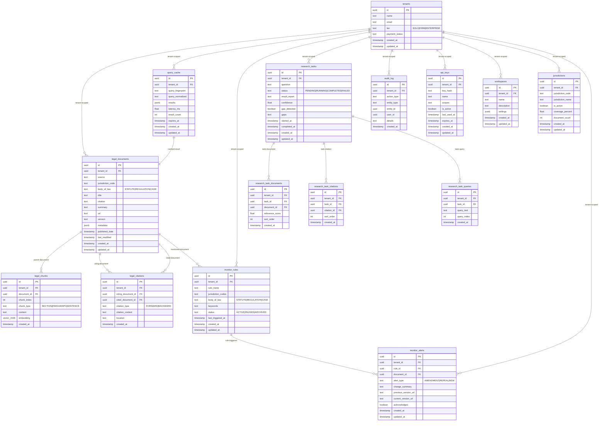
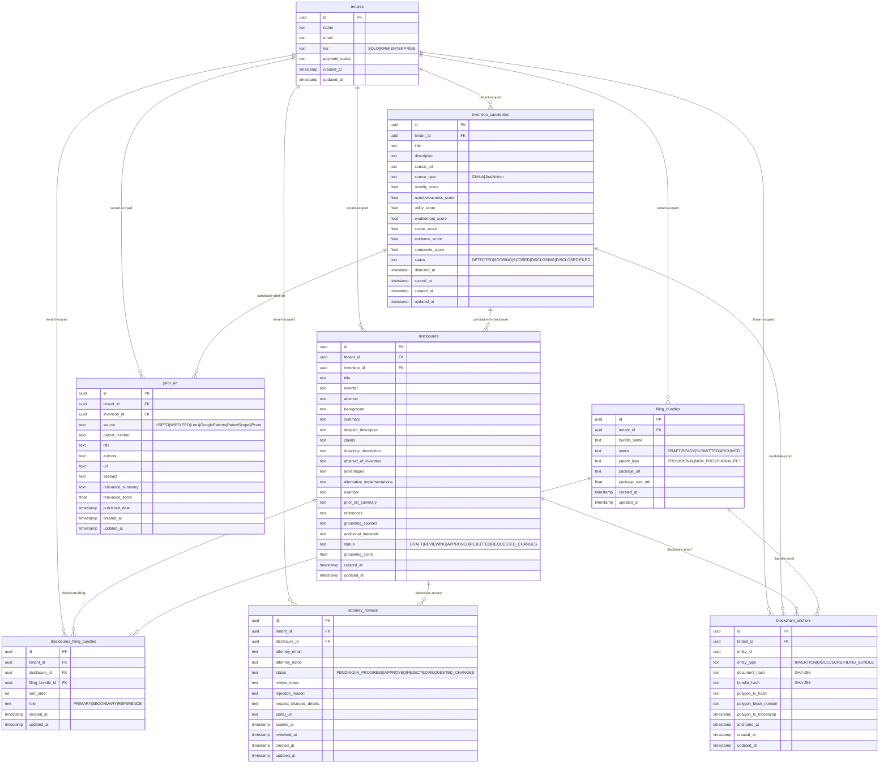
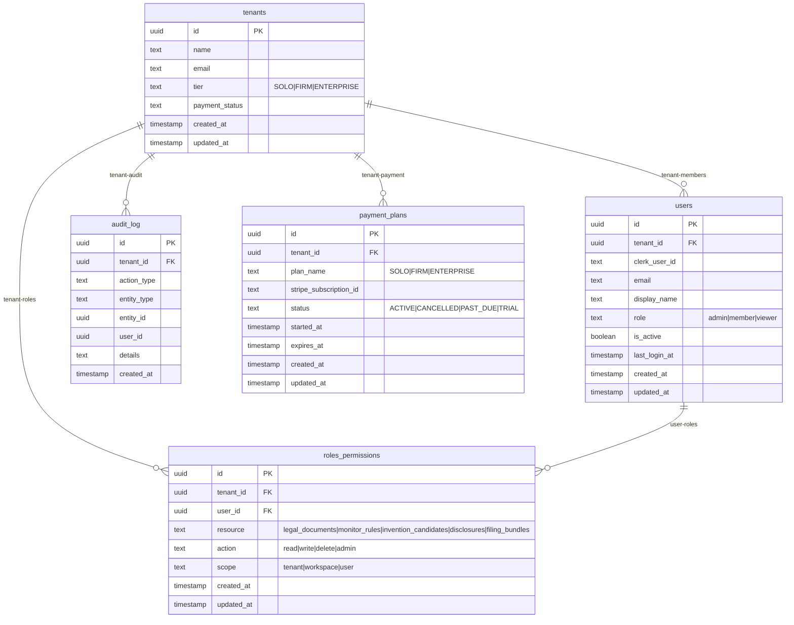

# ERD — Entity Relationship Diagram

> **Build System:** Unified Build System v2  
> **Chunk:** C03 — Data Model + Storage  
> **Horde:** HORDE-SCHEMA  
> **Control Plane:** ENGINEERING  

---

## LexCore Domain (10 Tables)

---

## LexRadar Domain (8 Tables)

---

## Shared / Platform Tables (6 Tables)

---

## Cross-Domain References

| From Table | To Table | Foreign Key | Relationship | Cascade |
|------------|----------|-------------|--------------|---------|
| legal_documents | tenants | tenant_id | many-to-one | ON DELETE CASCADE |
| legal_chunks | legal_documents | document_id | many-to-one | ON DELETE CASCADE |
| legal_chunks | tenants | tenant_id | many-to-one | ON DELETE CASCADE |
| legal_citations | legal_documents (citing) | citing_document_id | many-to-one | ON DELETE CASCADE |
| legal_citations | legal_documents (cited) | cited_document_id | many-to-one | ON DELETE CASCADE |
| legal_citations | tenants | tenant_id | many-to-one | ON DELETE CASCADE |
| query_cache | tenants | tenant_id | many-to-one | ON DELETE CASCADE |
| monitor_rules | tenants | tenant_id | many-to-one | ON DELETE CASCADE |
| monitor_alerts | monitor_rules | rule_id | many-to-one | ON DELETE CASCADE |
| monitor_alerts | legal_documents | document_id | many-to-one | ON DELETE SET NULL |
| monitor_alerts | tenants | tenant_id | many-to-one | ON DELETE CASCADE |
| research_tasks | tenants | tenant_id | many-to-one | ON DELETE CASCADE |
| research_task_documents | research_tasks | task_id | many-to-one | ON DELETE CASCADE |
| research_task_documents | legal_documents | document_id | many-to-one | ON DELETE CASCADE |
| research_task_documents | tenants | tenant_id | many-to-one | ON DELETE CASCADE |
| research_task_citations | research_tasks | task_id | many-to-one | ON DELETE CASCADE |
| research_task_citations | legal_citations | citation_id | many-to-one | ON DELETE CASCADE |
| research_task_citations | tenants | tenant_id | many-to-one | ON DELETE CASCADE |
| research_task_queries | research_tasks | task_id | many-to-one | ON DELETE CASCADE |
| research_task_queries | tenants | tenant_id | many-to-one | ON DELETE CASCADE |
| jurisdictions | tenants | tenant_id | many-to-one | ON DELETE CASCADE |
| audit_log | tenants | tenant_id | many-to-one | ON DELETE CASCADE |
| api_keys | tenants | tenant_id | many-to-one | ON DELETE CASCADE |
| workspaces | tenants | tenant_id | many-to-one | ON DELETE CASCADE |
| users | tenants | tenant_id | many-to-one | ON DELETE CASCADE |
| roles_permissions | tenants | tenant_id | many-to-one | ON DELETE CASCADE |
| roles_permissions | users | user_id | many-to-one | ON DELETE CASCADE |
| payment_plans | tenants | tenant_id | many-to-one | ON DELETE CASCADE |
| invention_candidates | tenants | tenant_id | many-to-one | ON DELETE CASCADE |
| disclosures | invention_candidates | invention_id | many-to-one | ON DELETE CASCADE |
| disclosures | tenants | tenant_id | many-to-one | ON DELETE CASCADE |
| prior_art | invention_candidates | invention_id | many-to-one | ON DELETE CASCADE |
| prior_art | tenants | tenant_id | many-to-one | ON DELETE CASCADE |
| blockchain_anchors | tenants | tenant_id | many-to-one | ON DELETE CASCADE |
| filing_bundles | tenants | tenant_id | many-to-one | ON DELETE CASCADE |
| disclosures_filing_bundles | disclosures | disclosure_id | many-to-one | ON DELETE CASCADE |
| disclosures_filing_bundles | filing_bundles | filing_bundle_id | many-to-one | ON DELETE CASCADE |
| disclosures_filing_bundles | tenants | tenant_id | many-to-one | ON DELETE CASCADE |
| attorney_reviews | disclosures | disclosure_id | many-to-one | ON DELETE CASCADE |
| attorney_reviews | tenants | tenant_id | many-to-one | ON DELETE CASCADE |

---

## Changelog

| Date | Change | Reason |
|------|--------|--------|
| 2026-04-29 | Initial ERD | C03 data model definition — LexCore 10 tables, LexRadar 8 tables, Platform 6 tables |
